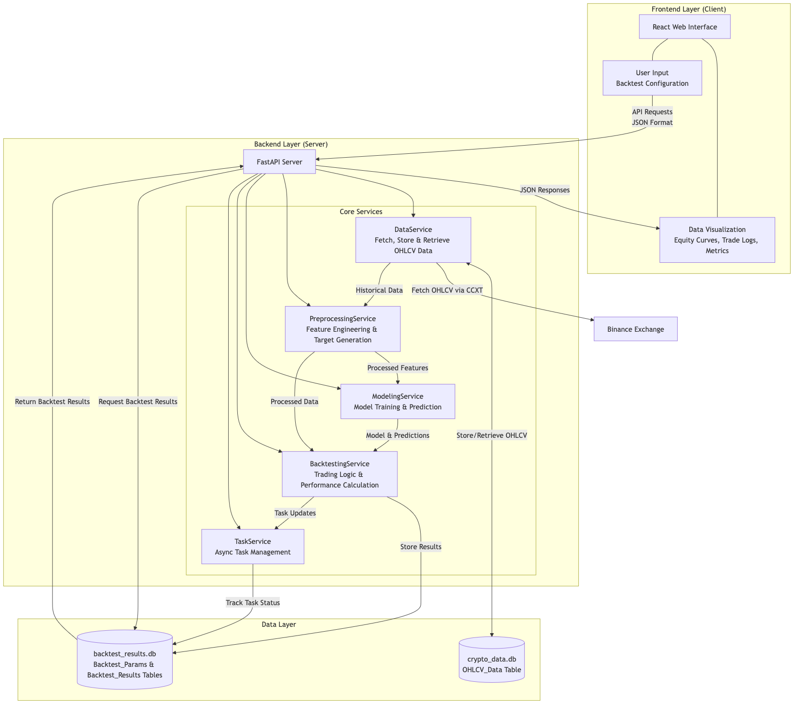
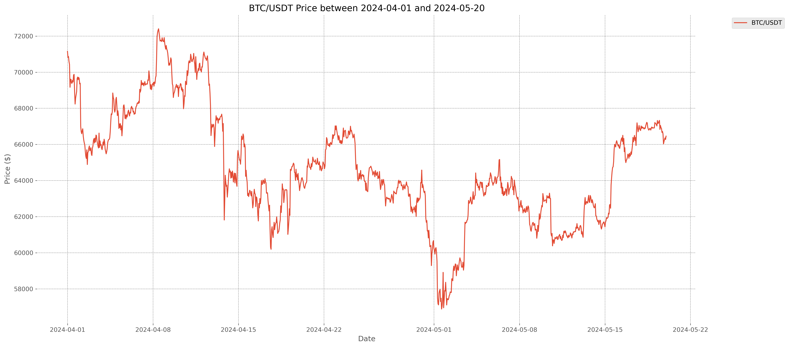
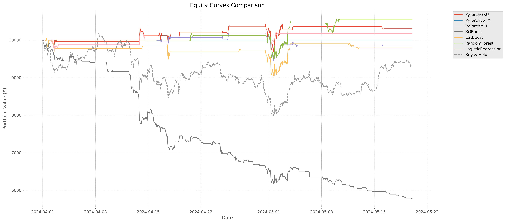
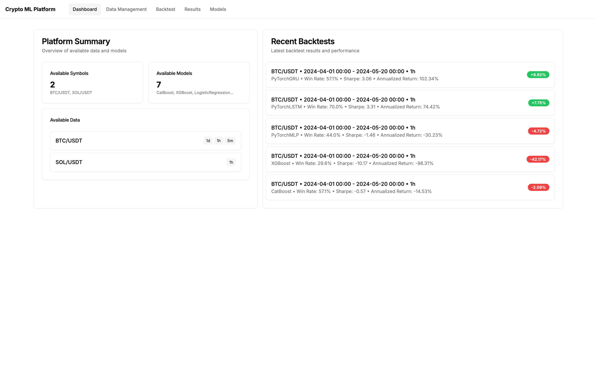
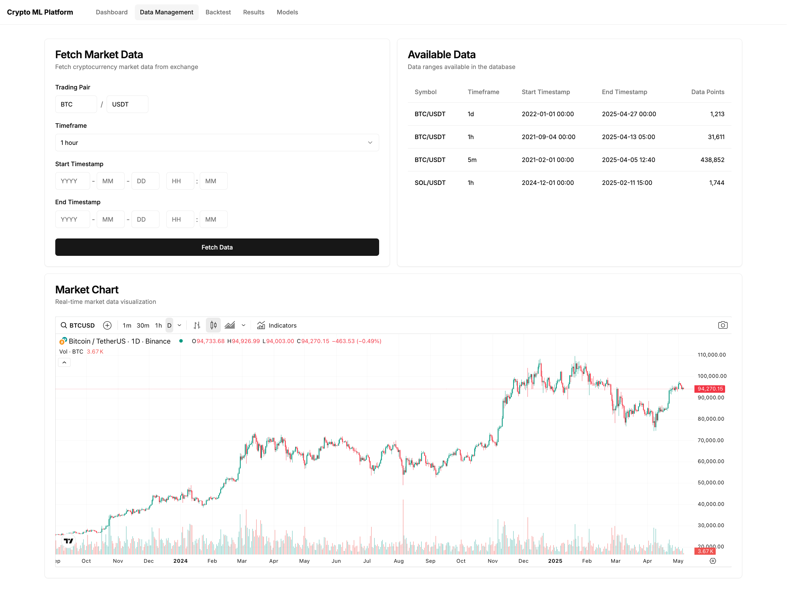
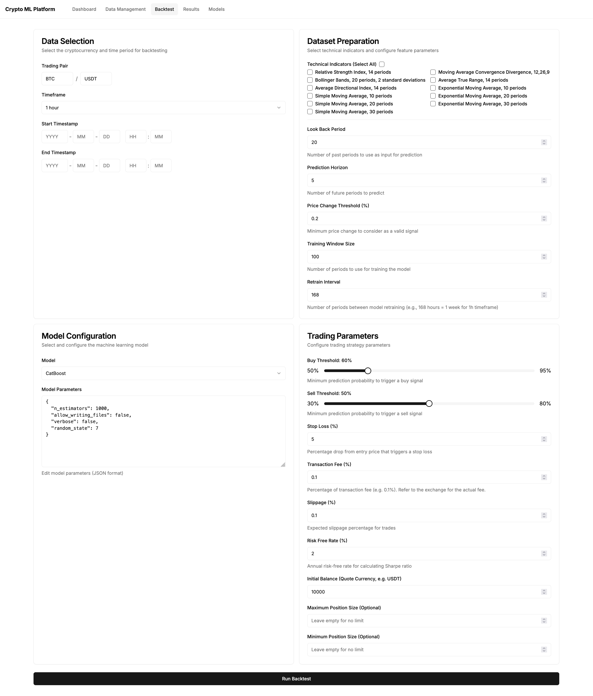
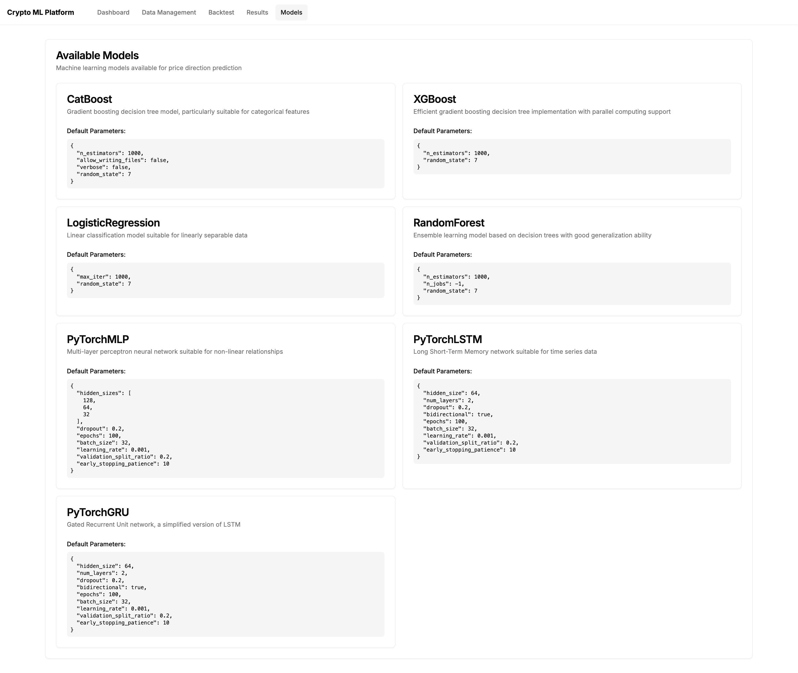
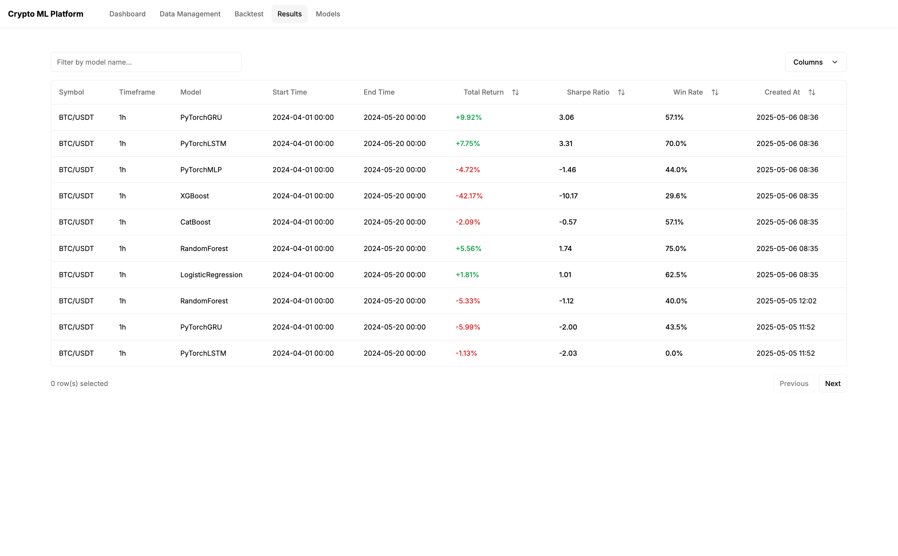
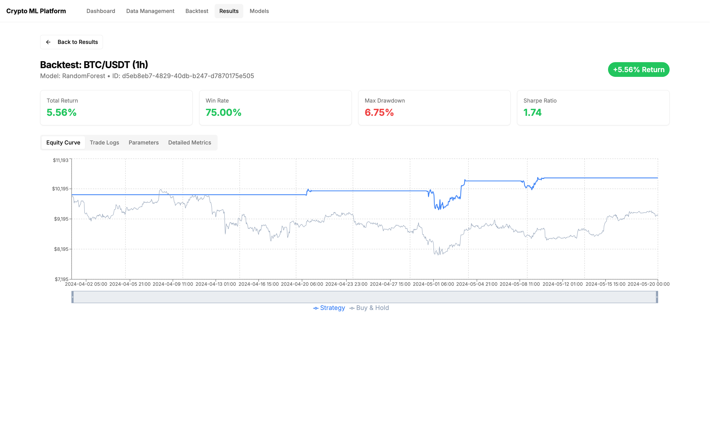

# Crypto ML Platform

> A comprehensive cryptocurrency trading strategy backtesting platform with machine learning prediction capabilities.

[](https://www.python.org/)
[](https://fastapi.tiangolo.com/)
[](https://nextjs.org/)
[](https://ui.shadcn.com/)
[](COPYING)

## Features

- **Real-time Market Data**: Automatically fetch OHLCV (Open, High, Low, Close, Volume) data from Binance
- **Multiple ML Models**: Support for 7 different machine learning models out-of-the-box (you can easily add your own):
  - CatBoost
  - XGBoost
  - Random Forest
  - Logistic Regression
  - PyTorch MLP
  - PyTorch LSTM
  - PyTorch GRU
- **Advanced Backtesting**: Rolling window backtesting with periodic model retraining
- **Comprehensive Metrics**: 20+ performance metrics including Sharpe Ratio, Sortino Ratio, Maximum Drawdown, Win Rate, and more
- **Interactive Dashboard**: Modern web interface for data management, model configuration, and results visualization
- **Technical Indicators**: Built-in support for 50+ technical indicators via TA-Lib

## System Architecture



The platform follows a modern microservices architecture:

- **Backend**: FastAPI-based REST API with async task support
- **Frontend**: Next.js 15 with React 19 and TypeScript
- **Database**: SQLite for persistent storage
- **Data Source**: Binance via CCXT library

## Performance Showcase

The platform has been tested on real market data. Below are the experimental setup and results from a backtest on Bitcoin (BTC/USDT).

### Experimental Setup

#### Market Conditions

- **Asset & Timeframe:** BTC/USDT on 1-hour intervals. This balances sufficient training data (unlike daily charts) and reduced market noise (compared to 15-minute intervals).
- **Period:** April 1, 2024 – May 20, 2024. This period includes both a downtrend (Apr 8 – May 1) and a significant uptrend (May 1 – May 20), providing a robust test environment.


*Price action from 2024-04-01 to 2024-05-20, showing the volatile conditions used for testing.*

#### Feature Engineering

- **Lookback Window:** 20 hours
- **Indicators Used:** RSI_14, MACD_12_26_9, BBANDS_20_2_2, ATR_14, ADX_14, EMA_10, SMA_10, EMA_20, SMA_20, EMA_30, SMA_30
- **Target:** Price change threshold of 0.3%, predicted 3 hours ahead
- **Training:** Rolling window of 1500 hours

#### Backtesting Parameters

| Parameter           | Value                                        |
| ------------------- | -------------------------------------------- |
| Initial Capital     | $10,000                                      |
| Transaction Fee     | 0.1% per trade (Binance rate, applied twice) |
| Slippage            | 0.1%                                         |
| Risk-Free Rate      | 2% annually                                  |
| Retraining Interval | Weekly (168 hours)                           |
| Buy Threshold       | 0.7                                          |
| Sell Threshold      | 0.5                                          |
| Stop Loss           | 5%                                           |

#### Model Hyperparameters

##### Deep Learning (PyTorch)

- **GRU & LSTM:** `hidden_size=64`, `num_layers=2`, `dropout=0.2`, `bidirectional=true`, `epochs=100`, `batch_size=32`, `learning_rate=0.001`, `validation_split=0.2`, `patience=10`
- **MLP:** Same as above, with `hidden_sizes=[128, 64, 32]`

##### Tree-Based & Classical

- **XGBoost:** `n_estimators=1000`, `random_state=7`
- **CatBoost:** `iterations=1000`, `verbose=False`, `random_state=7`
- **RandomForest:** `n_estimators=1000`, `n_jobs=-1`, `random_state=7`
- **LogisticRegression:** `max_iter=1000`, `random_state=7`

### Results

During this period, Bitcoin experienced a significant decline of **-6.6%** (Buy & Hold strategy). Our ML models successfully navigated this volatile market:



| Strategy           | Total Return (%) | Sharpe Ratio | Max Drawdown (%) | Win Rate (%) |
| ------------------ | ---------------- | ------------ | ---------------- | ------------ |
| Buy & Hold         | -6.60            | —            | —                | —            |
| **RandomForest**   | **5.56**         | **1.74**     | **6.75**         | **75.00**    |
| PyTorchGRU         | 3.02             | 0.98         | 6.96             | 46.15        |
| LogisticRegression | 1.81             | 1.01         | 3.65             | 62.50        |
| PyTorchLSTM        | 0.00             | 0.00         | 0.00             | 0.00         |
| PyTorchMLP         | -1.62            | -0.71        | 7.33             | 53.85        |
| CatBoost           | -2.09            | -0.57        | 10.02            | 57.14        |
| XGBoost            | -42.17           | -10.17       | 42.21            | 29.63        |

## User Interface

### Dashboard



Overview of your trading activities with recent backtests and available data summary.

### Data Management



Fetch and manage market data from Binance with automatic duplicate detection and incremental updates.

### Run Backtest



Configure backtest parameters including model selection, technical indicators, and trading rules.

### Available Models



Browse available ML models with detailed parameter descriptions and requirements.

### Backtest Results



View all historical backtests with key performance metrics at a glance.

### Result Detail - Equity Curve



Interactive equity curve visualization with position and trade markers.

## Quick Start

### Prerequisites

- Python 3.12 or higher
- Node.js 18 or higher
- uv (Python package manager) - [Install uv](https://github.com/astral-sh/uv)

### Backend Setup

```bash
cd backend

# Install dependencies
uv sync

# Start development server
uv run python run.py
```

The backend API will be available at `http://0.0.0.0:8000`

### Frontend Setup

```bash
cd frontend

# Install dependencies
npm install

# Start development server
npm run dev
```

The web interface will be available at `http://localhost:3000`

## Usage

1. **Fetch Market Data**: Navigate to the Data page and select your trading pair, timeframe, and date range
2. **Configure Backtest**: Go to the Backtest page and select your model, technical indicators, and trading parameters
3. **Run Backtest**: Submit your configuration and wait for the results
4. **Analyze Results**: View detailed metrics, equity curves, and trade logs on the Results page

## Project Structure

```text
crypto-ml/
├── backend/                 # FastAPI backend
│   ├── app/
│   │   ├── api/endpoints/  # API route handlers
│   │   ├── core/           # Business logic services & model wrappers
│   │   ├── db/             # Database models and sessions
│   │   ├── schemas/        # Pydantic schemas
│   │   └── main.py         # FastAPI app entry
│   ├── data/               # SQLite databases
│   ├── pyproject.toml      # Python dependencies
│   ├── uv.lock             # Dependency lock file
│   └── run.py              # Server entry point
├── frontend/               # Next.js frontend
│   ├── app/               # Next.js App Router pages
│   ├── components/        # React components & shadcn/ui
│   ├── hooks/             # Custom React hooks
│   ├── lib/               # Utilities & API client
│   ├── styles/            # Global styles
│   ├── package.json       # Node dependencies
│   └── tsconfig.json      # TypeScript config
├── figures/               # Documentation images
├── .cz.toml              # Commitizen configuration
├── COPYING                # GPL v3 license
├── CLAUDE.md              # Claude Code guidance
└── README.md
```

## Configuration

### Environment Variables

Create a `.env` file in the `frontend` directory:

```bash
NEXT_PUBLIC_API_BASE_URL=http://localhost:8000/api
```

### Database

The platform uses SQLite databases stored in `backend/data/`:

- `crypto_data.db` - Market OHLCV data
- `backtest_results.db` - Backtest parameters and results

## Tech Stack

### Backend

- **FastAPI**: Modern, fast web framework for building APIs
- **SQLAlchemy**: SQL toolkit and ORM
- **CCXT**: Unified cryptocurrency exchange API
- **TA-Lib**: Technical analysis library
- **PyTorch**: Deep learning framework
- **CatBoost / XGBoost / scikit-learn**: Machine learning libraries

### Frontend

- **Next.js**: React framework with App Router
- **TypeScript**: Type-safe JavaScript
- **Tailwind CSS**: Utility-first CSS framework
- **shadcn/ui**: Accessible UI component library built on Radix UI

## License

This project is licensed under the GNU General Public License v3.0 - see the [COPYING](COPYING) file for details.

## Contributing

Contributions are welcome! Please feel free to submit a Pull Request.

## Disclaimer

This software is for educational and research purposes only. Cryptocurrency trading involves substantial risk of loss. Past performance does not guarantee future results. Always do your own research before making any investment decisions.
